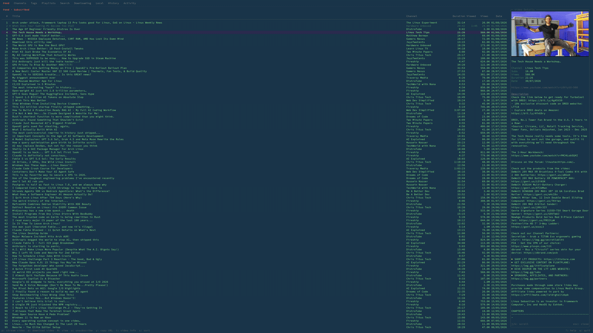

# yt-tui

A fast, keyboard-driven **terminal UI for YouTube** — browse recommendations and
subscriptions, search, manage playlists, download video/audio, and play it all
without ever opening a browser. Built with [Bubble Tea](https://github.com/charmbracelet/bubbletea),
powered by [yt-dlp](https://github.com/yt-dlp/yt-dlp), and backed by a local
SQLite cache so every list opens instantly and refreshes in the background.

No API keys. No telemetry. No accounts beyond the browser cookies you already
have.

[](https://github.com/EugeneShtoka/yt-tui/actions/workflows/ci.yml)
[](https://github.com/EugeneShtoka/yt-tui/releases/latest)
[](LICENSE)
[](go.mod)
[](https://github.com/charmbracelet/bubbletea)

---

## Contents

- [Highlights](#highlights)
- [Demo](#demo)
- [Features](#features)
- [Requirements](#requirements)
- [Installation](#installation)
- [Quick start](#quick-start)
- [Usage & keybindings](#usage--keybindings)
- [Configuration](#configuration)
- [Remote daemon](#remote-daemon)
- [How it works](#how-it-works)
- [Privacy](#privacy)
- [Comparison](#comparison)
- [Troubleshooting](#troubleshooting)
- [Roadmap & known limitations](#roadmap--known-limitations)
- [Contributing](#contributing)
- [License](#license)
- [Acknowledgments](#acknowledgments)

---

## Highlights

- **Everything in the terminal.** Recommendations, subscriptions, search,
  playlists, downloads, and playback — one vim-style TUI, no browser tab.
- **Instant.** Every feed and channel list loads from a local SQLite cache
  immediately, then refreshes in the background. You never wait on a spinner to
  start scrolling.
- **Private by design.** All traffic goes through yt-dlp using your existing
  browser cookies. No official YouTube API, no API key, no telemetry, nothing
  phones home.
- **Yours to shape.** Data-driven panels, per-panel columns, fully remappable
  keybindings, a configurable two-level chord system, hint modes, and themes.
- **Optionally headless.** Run the `yt-tuid` daemon on a server (or a box with
  the good internet) and drive it from a thin local client over authenticated,
  TLS-encrypted RPC.

## Demo



## Features

**Browsing & discovery**

- Recommended feed and subscriptions feed (via your browser's YouTube cookies) —
  your subscription list is pulled from your account automatically on launch and
  kept in sync as you subscribe/unsubscribe on YouTube
- A unified **Channels** view: subscribed, recommended, blocked, and stale
  channels, each with its latest video shown inline
- **Tags** view — organize channels with your own tags and browse by tag
- YouTube **search** with persistent, navigable search history (`↑`/`↓` in the
  search box)
- Drill into any channel to see its full video list
- Per-column sorting everywhere: date, views, name, channel, duration,
  subscribers, tags, file size

**Playback**

- Stream or play any video/audio directly with mpv, VLC, or any configured player
- **Resume position tracking** for every video (streamed *and* downloaded) via
  MPRIS/D-Bus — pick up exactly where you left off
- Visual indicators for downloaded, watched, and partially-watched videos
- Video detail overlay: full description, thumbnail (inline, in supported
  terminals), subscriber count, chapters, and extracted links
- **Transcript overlay** with chapter navigation and one-key copy

**Downloading**

- Download video (MKV, with embedded subtitles) or audio (configurable format)
- Concurrent download queue with live progress, speed, and ETA
- Queue a video to **auto-play the moment its download finishes**
- Automatic subtitle download & embedding (configurable languages)
- Automatic [SponsorBlock](https://sponsor.ajay.app/) segment removal, snapped to
  sentence boundaries
- Files named `Channel - Title.ext`

**Library & organization**

- Local playlists plus full YouTube playlist and Watch Later management
- Subscribe / unsubscribe and block / unblock channels from any tab
- Hide videos from recommendations; channels auto-block after configurable strikes
- Per-video **history** with a replayable event log (re-run a past search from
  history) and an **activity log** of your actions
- **Export / import** your library (channels, playlists, tags, blocks, config
  profile, optional watch history) as a portable bundle — export opens a
  selection overlay so you choose exactly which sections to include

**Interface**

- Vim-style navigation (`hjkl`, `gg`/`G`, `{n}G`, page keys)
- Two-level **chord system** for tab switching (`t`+key) and sorting (`s`+key)
- A `:` **command palette** for less-frequent actions
- Data-driven **panels**: define which tabs exist, their order, mode, sort, and
  visible columns
- Configurable hint-bar density, keybindings, and color themes
- Optional **client/daemon** mode over authenticated TLS RPC

## Requirements

**Required**

- [yt-dlp](https://github.com/yt-dlp/yt-dlp) — the network/download engine
- A media player — [mpv](https://mpv.io/) recommended (VLC, `cvlc`, and
  `ffplay` also work); set any binary in `config.toml`
- A Chromium- or Firefox-family browser with an active YouTube login — cookies
  are read from it for recommendations, subscriptions, and playlist sync

**Recommended / optional**

- **ffmpeg** — used by yt-dlp for merging formats, embedding subtitles, and
  SponsorBlock removal (most yt-dlp installs pull it in)
- **D-Bus** — required for MPRIS position tracking (`player_backend = "mpris"`);
  without it, fall back to `player_backend = "simple"`
- A **true-color terminal** with the **kitty graphics protocol** (kitty, WezTerm,
  Ghostty, …) to see inline thumbnails in the detail overlay; everything else
  works without it

**Platform support**

- **Linux** — the primary target; full feature set, including MPRIS/D-Bus resume
  tracking.
- **macOS** — supported (prebuilt binaries provided). Playback uses the `simple`
  backend, so **resume tracking is unavailable** (no MPRIS on macOS).
- **Windows** — **use [WSL2](https://learn.microsoft.com/windows/wsl/)** and run
  the Linux build. Native Windows is not supported: resume tracking and inline
  thumbnails wouldn't work there anyway, and WSL2 gives you the full experience.

## Installation

> There are two binaries: **`yt-tui`** (the client) and, optionally,
> **`yt-tuid`** (the headless daemon). Not yet in distro/package-manager
> repositories.

**Prebuilt binary** (recommended — no Go toolchain needed):

Download the archive for your platform from the
[latest release](https://github.com/EugeneShtoka/yt-tui/releases/latest),
extract it, and put the binaries on your `PATH`:

```sh
# Example: Linux x86_64 — check the releases page for the current version/URL.
tar -xzf yt-tui_*_linux_amd64.tar.gz
install -m755 yt-tui yt-tuid ~/.local/bin/   # yt-tuid optional
```

Archives are published for linux and macOS on amd64/arm64, with a
`checksums.txt` you can verify against.

**With Go** (Go 1.26+):

```sh
go install github.com/EugeneShtoka/yt-tui/cmd/yt-tui@latest
# optional daemon:
go install github.com/EugeneShtoka/yt-tui/cmd/yt-tuid@latest
```

**From source:**

```sh
git clone https://github.com/EugeneShtoka/yt-tui
cd yt-tui
go build -o yt-tui  ./cmd/yt-tui
go build -o yt-tuid ./cmd/yt-tuid   # optional daemon
```

**Verify:**

```sh
yt-dlp --version   # make sure the engine is present
yt-tui --version   # confirm the install and print build info
yt-tui             # launches the TUI; writes a default config on first run
```

## Quick start

1. Install `yt-dlp` and `mpv`, and log into YouTube in your browser.
2. Run `yt-tui`. On first launch it writes `~/.config/yt-tui/config.toml` and
   opens on the **Feed** tab.
3. Set your browser in the config if it isn't `vivaldi`:
   ```toml
   browser = "firefox"   # anything yt-dlp --cookies-from-browser accepts
   ```
   (chrome, firefox, brave, vivaldi, `vivaldi+gnomekeyring`, …)
4. Back in the app: move with `j`/`k`, press `p` to play, `d` to download,
   `i` for details, `t` then `S` to jump to Search, and `?` for the full help.

That's it — everything else is discoverable from the hint bar and `?`.

## Usage & keybindings

yt-tui is modal-free and vim-flavored. Keys are shown in the status bar and the
`?` help screen, and **every binding below is configurable** (see
[Configuration](#configuration)). Defaults:

### Navigation

| Key | Action |
| --- | --- |
| `j` / `↓` | Move down |
| `k` / `↑` | Move up |
| `l` / `→` | Drill down / open |
| `h` / `Backspace` / `←` | Go back / close pane |
| `Ctrl+d` / `PgDn` | Page down |
| `Ctrl+u` / `PgUp` | Page up |
| `gg` | Jump to top |
| `G` | Jump to bottom |
| `{n}G` | Jump to row *n* |
| `Tab` / `Shift+Tab` | Next / previous tab |
| `/` | Local filter input |

### Tab switching — chord `t` + key

Press `t`, then the tab's key (the status bar lists them). `t` + a digit
`1`–`9` also jumps to the *n*-th panel.

| Key | Tab | | Key | Tab |
| --- | --- | --- | --- | --- |
| `f` | Feed        | | `d` | Downloading |
| `c` | Channels    | | `l` | Local |
| `t` | Tags        | | `h` | History |
| `p` | Playlists   | | `a` | Activity |
| `S` | Search      | | | |

### Sorting — chord `s` + key

Press `s`, then a sort key. Only sorts backed by a **visible column** in the
current panel are offered.

| Key | Sort by | | Key | Sort by |
| --- | --- | --- | --- | --- |
| `d` | Date        | | `D` | Duration |
| `v` | Views       | | `s` | Subscribers |
| `n` | Name        | | `t` | Tags |
| `c` | Channel     | | `z` | Size |

### Video actions

| Key | Action |
| --- | --- |
| `Enter` | Context action: stream video / open channel / open playlist / show history detail |
| `p` | Play video (streams, or plays the local file if downloaded) |
| `P` | Play audio |
| `d` | Download video |
| `D` | Download audio |
| `i` | Toggle the video detail overlay |
| `x` | Delete local file / remove from queue |
| `y` | Copy video URL |
| `b` | Hide video from recommendations |
| `a` | Add to a playlist |

### Channels

| Key | Action |
| --- | --- |
| `S` then `r`/`l` | Subscribe — remote (YouTube) or local-only |
| `u` | Unsubscribe |
| `X` | Toggle block / unblock the channel |
| `B` | Hide/block channel from recommendations |
| `A` | Rename (set an alias for) the channel |
| `T` | Tag the channel |
| `m` | Toggle the panel's source mode (e.g. All videos ↔ Channels) |
| `M` | Open the panel view/mode picker |
| `r` | Refresh current tab |
| `R` | Force full re-fetch of all subscribed channels |

### Detail & transcript overlay

| Key | Action |
| --- | --- |
| `i` | Open/close the video detail panel |
| `f` | Toggle focus between the list and the detail panel |
| `L` | Open the links picker |
| `C` | Open chapters |
| `e` | Open the transcript |
| `]` / `[` | Next / previous chapter (in the transcript) |
| `y` | Copy the full transcript (in the transcript) |

### Library & app

| Key | Action |
| --- | --- |
| `n` | New playlist |
| `E` | Export to a bundle file — opens a selection overlay (Space toggles a section, Enter writes) |
| `I` | Import a bundle (opens the preview overlay) |
| `:` | Open the command palette |
| `?` | Toggle help |
| `Esc` | Close/cancel an overlay |
| `q` / `Ctrl+c` | Quit |

### Command palette (`:`)

Type `:` for less-frequent or free-text actions. Tab completes; the active panel
may add its own commands.

| Command | Aliases | Action |
| --- | --- | --- |
| `:tab <name>` | | Switch to a panel by name |
| `:download <url>` | | Enqueue a URL for download |
| `:clear-downloads` | `:cd` | Dismiss the whole download queue (files untouched) |
| `:delete-all-local` | `:reclaim-space` | Delete every downloaded file (confirms first) |
| `:help` | `:commands` | List all commands |
| `:quit` | `:q` | Quit |

## Configuration

### Location & format

A commented `config.toml` is written to `~/.config/yt-tui/` on first run (exact
path follows the XDG base-dir spec). The file is **flat TOML** — client and
daemon keys live at the top level. yt-tui re-saves it on every start so newly
added keys appear automatically. Runtime data (the SQLite DB) lives under
`$XDG_DATA_HOME/yt-tui`, and the debug log under `$XDG_STATE_HOME/yt-tui`.

### Annotated example

```toml
# ── Engine / downloads (also used by the daemon) ─────────────────────
download_dir             = "~/Videos/yt-tui"
browser                  = "vivaldi+gnomekeyring"  # yt-dlp --cookies-from-browser
max_concurrent_downloads = 3
audio_format             = "mp3"
sponsorblock             = true
sponsorblock_categories  = ["sponsor", "selfpromo", "interaction"]
subtitles                = true
subtitle_langs           = ["en"]                  # regex patterns for --sub-langs
strip_emojis             = true

# Feed tuning
recommended_max_age_days   = 7
recommended_fetch_count    = 150
recommended_max_pages      = 3
channel_latest_count       = 3     # videos fetched per channel on background refresh
channel_refresh_minutes    = 60
channel_strikes            = 2     # hide-video strikes before auto-blocking a channel
enrichment_delay_seconds   = 5     # pacing for background detail/thumbnail fetches
thumbnails_per_channel     = 30

# ── Client / TUI ─────────────────────────────────────────────────────
player           = "mpv"
player_backend   = "mpris"         # "mpris" (resume tracking) | "simple"
hint_mode        = "full"          # "full" | "minimal" | "none"
duration_format  = "hh:mm:ss"
transcript_width = "50%"           # popup width: columns ("80") or percent ("50%")
circular_nav     = false
# theme          = "theme.toml"    # path relative to config dir, or absolute

# Default source modes (inherited by panels that don't override)
feed_mode     = "recommended"      # recommended | subscribed | mixed | stale
channels_view = "subscribed"       # recommended | subscribed | mixed | blocked | stale
tags_mode     = "subscribed"       # recommended | subscribed | mixed | stale
hide_stale_tagged_channels = false
stale_tagged_channel_days  = 30

# Tabs are data-driven: one [[panels]] block per tab, in display order.
[[panels]]
name = "feed"
type = "feed"
# mode = "subscribed"   # optional, overrides feed_mode for THIS panel
# sort = "date"         # optional default sort

[[panels]]
name = "channels"
type = "channels"

# … repeat for tags, playlists, search, downloading, local, history, activity

# Per-panel columns: filter + reorder a panel's list by column key.
# Omit for the full default column set.
[columns]
feed  = ["num", "indicator", "title", "channel", "duration", "date"]
local = ["num", "title", "channel", "size", "date"]

[keybindings]
# … see "Keybindings" below; comma-separate for multiple keys, e.g. play = "p,enter"
```

### Key options

| Option | Type | Default | Notes |
| --- | --- | --- | --- |
| `download_dir` | path | `~/Videos/yt-tui` | Where downloads land |
| `browser` | string | `vivaldi+gnomekeyring` | Passed to `yt-dlp --cookies-from-browser`; any value it accepts |
| `player` | string | `mpv` | Player binary; falls back through mpv/vlc/cvlc/ffplay |
| `player_backend` | string | `mpris` | `mpris` tracks position via D-Bus; `simple` just spawns the player |
| `max_concurrent_downloads` | int | `3` | Parallel yt-dlp processes |
| `audio_format` | string | `mp3` | Audio download container |
| `sponsorblock` | bool | `true` | Remove SponsorBlock segments on download |
| `sponsorblock_categories` | list | `sponsor, selfpromo, interaction` | Which segment types to cut |
| `subtitles` | bool | `true` | Download & embed subtitles (MKV) |
| `subtitle_langs` | list | `["en"]` | Regex patterns for `--sub-langs` (`"en.*"` → `en`, `en-US`, …) |
| `recommended_max_age_days` | int | `7` | Drop older videos from the recommended feed |
| `recommended_fetch_count` | int | `150` | Target size of a recommended fetch |
| `channel_latest_count` | int | `3` | Videos pulled per channel on background refresh |
| `channel_refresh_minutes` | int | `60` | Background channel-refresh interval |
| `channel_strikes` | int | `2` | Hide-video strikes before a channel is auto-blocked |
| `hint_mode` | string | `full` | Status-bar hint density (see below) |
| `duration_format` | string | `hh:mm:ss` | Duration column format (see below) |
| `circular_nav` | bool | `false` | Wrap cursor from bottom to top |
| `feed_mode` / `channels_view` / `tags_mode` | string | see example | Default source mode per tab family |

#### Panels & columns

`[[panels]]` blocks define the tab bar — one block per tab, in order. Each names
a stable `name` (referenced by tab hotkeys and `:tab`), a `type`
(`feed`, `channels`, `tags`, `playlists`, `search`, `downloading`, `local`,
`history`, `activity`), and optionally a source `mode` and default `sort`. You
can run several panels of the same type with different modes/columns. Remove a
block to hide that tab; an empty/invalid list falls back to the default layout.

The `[columns]` table maps a panel `name` to an ordered list of column keys. A
present list both **filters** (only listed columns show) and **reorders** (list
order wins); omitting an entry shows the full default set. Unknown keys are
reported at startup and ignored. Available columns depend on the panel type.

#### `hint_mode`

- `full` — all context-relevant bindings; chords shown as their trigger key
- `minimal` — only `j/k: move  t: tab  p: play`
- `none` — empty left side (`?: help  q: quit` always on the right)

A chord in progress always expands to show completions, regardless of mode.

#### `duration_format`

Controls how durations render in list views. Uppercase component letters are
zero-padded; lowercase are not. A lowercase `hh` prefix suppresses the hours
field when it is zero.

| Format | 1h5m30s | 45m30s |
| --- | --- | --- |
| `hh:mm` | `1:05` | `45` |
| `HH:MM` | `01:05` | `00:45` |
| `hh:mm:ss` | `1:05:30` | `45:30` |
| `HH:MM:SS` | `01:05:30` | `00:45:30` |
| `mmm` / `MMM` | `65` / `065` | `45` / `045` |
| `mmm:ss` / `MMM:SS` | `65:30` / `065:30` | `45:30` / `045:30` |

When a resume position exists the column shows `pos/total` (e.g. `3:15/1:05`).

### Keybindings

All keys live under `[keybindings]`, with chord sub-keys nested under
`[keybindings.tab_keys]`, `[keybindings.sort_keys]`,
`[keybindings.subscribe_keys]`, and `[keybindings.playlist_keys]`. Values are
comma-separated for multiple bindings (`play = "p,enter"`); chord sub-keys accept
multi-character sequences (`search = "se"`). Arrow keys are always bound
alongside their vim equivalents. See the defaults in
[Usage & keybindings](#usage--keybindings) — the generated config file lists
every option inline.

### Theming

Set `theme = "theme.toml"` (relative to the config dir, or an absolute path).
The file overrides palette colors (accent, muted, subtle, success, warning,
error, selection background, border, highlight); anything omitted falls back to
the built-in defaults.

## Remote daemon

`yt-tuid` is a headless daemon that hosts the backend (DB, downloads, library,
enrichment) so heavy lifting happens on a server while the TUI runs locally over
authenticated, TLS-encrypted [Connect](https://connectrpc.com) RPC. Downloaded
files can be streamed back to your local player via a signed `/media` endpoint.

### Server setup

1. **Build/copy** the binary: `go build -o yt-tuid ./cmd/yt-tuid`.
2. **Generate a token:** `openssl rand -hex 32`.
3. **TLS cert** (your CA, or self-signed):
   ```sh
   openssl req -x509 -newkey rsa:4096 -days 3650 -nodes \
     -keyout server.key -out server.crt -subj "/CN=yt-tuid"
   ```
4. **Daemon `config.toml`** (top-level keys — same flat format as the client):
   ```toml
   token        = "your-token-here"
   download_dir = "/srv/yt-tui/videos"
   tls_cert     = "/etc/yt-tui/server.crt"
   tls_key      = "/etc/yt-tui/server.key"

   # Headless cookie auth — export a Netscape cookies.txt from a logged-in
   # browser (e.g. the "Get cookies.txt LOCALLY" extension).
   cookies_file = "/etc/yt-tui/cookies.txt"
   ```
5. **Start:** `yt-tuid --listen 0.0.0.0:7373` (or use `deploy/yt-tuid.service`).
   Flags: `--listen`, `--token`, `--tls-cert`, `--tls-key` override config.
6. **Firewall:** expose port 7373 to trusted clients only. Never run the daemon
   without both a token and TLS. `/healthz` is unauthenticated for liveness
   checks; everything else requires the bearer token.

### Client setup

Add to `~/.config/yt-tui/config.toml` on the client:

```toml
daemon_addr  = "https://server:7373"
daemon_token = "your-token-here"
tls_ca_cert  = "/path/to/server.crt"   # only for self-signed certs
# load_profile = "laptop"              # optional: apply a daemon-stored config profile on connect
```

Run `yt-tui` — it connects automatically. `--connect` overrides `daemon_addr`
for a one-off:

```sh
yt-tui --connect https://server:7373
```

## How it works

- **yt-dlp for everything network.** Feeds, search, channel/playlist listings,
  metadata, subtitles, and downloads are all yt-dlp subprocesses parsed as JSON.
  Subscribe/unsubscribe and playlist edits use YouTube's internal web API
  authenticated with your browser cookies (SAPISIDHASH-signed) — **no official
  API key.**
- **Cache-first UI.** A single SQLite database (pure-Go driver, no CGo) stores
  feeds, channels, history, positions, and detail caches. Lists render from cache
  instantly; a background pass refreshes them and enriches videos (correcting
  upload dates, caching thumbnails and transcripts, computing SponsorBlock cuts).
- **One backend, two topologies.** A single `Backend` interface sits between the
  UI and the outside world. In single-binary mode the TUI calls it in-process; in
  daemon mode the same backend runs behind Connect RPC and the TUI is a thin
  client. Neither the UI nor tests can tell which is behind the interface.
- **Resume tracking** is done by polling the player's MPRIS `Position` property
  over D-Bus and persisting the offset per video.

For a full tour, see **[ARCHITECTURE.md](ARCHITECTURE.md)**.

## Privacy

yt-tui is built to be a quiet, local tool:

- **No telemetry.** Nothing is collected, logged remotely, or sent anywhere.
- **No API keys or accounts.** It uses YouTube's web endpoints through yt-dlp
  with your existing browser cookies — the same session your browser already has.
- **Cookies stay local.** They're read on demand via
  `yt-dlp --cookies-from-browser` (or a `cookies.txt` you point at) and never
  leave your machine, except to YouTube itself as normal request headers.
- **Your data is yours.** Cache and library live in a local SQLite file you can
  inspect, back up, export, or delete. Export/import bundles are plain JSON.
- **Daemon mode is single-tenant and locked down.** It requires a bearer token
  and TLS; there is no third party in the loop — just your client and your server.

## Comparison

| | **yt-tui** | ytfzf | FreeTube | `yt-dlp` + mpv scripts |
| --- | --- | --- | --- | --- |
| Interface | Full TUI (tabs, panels, overlays) | fzf menus | Electron GUI | Ad-hoc CLI |
| Recommendations & subs | ✅ (your cookies) | ⚠️ limited | ✅ | ❌ |
| Persistent local cache | ✅ SQLite | ❌ | ✅ | ❌ |
| Resume positions | ✅ streamed + local | ❌ | ✅ | ⚠️ manual |
| Download queue | ✅ concurrent, live | ⚠️ basic | ✅ | ⚠️ manual |
| SponsorBlock | ✅ built-in | ⚠️ via mpv | ✅ | ⚠️ manual |
| Remote/headless mode | ✅ daemon + RPC | ❌ | ❌ | ❌ |
| Resource footprint | Tiny (terminal) | Tiny | Heavy (Electron) | Tiny |
| API key required | ❌ | ❌ | ❌ (or optional) | ❌ |

_Comparison is a good-faith summary; other projects evolve — check their docs for
the latest._

## Troubleshooting

**Empty recommendations / subscriptions.**
Make sure you're logged into YouTube in the browser named by `browser`, and that
`yt-dlp` can read its cookies (`yt-dlp --cookies-from-browser <browser> ...`).
Some setups need a keyring suffix, e.g. `vivaldi+gnomekeyring`. The subscription
list is re-synced from your account on every launch, so if you delete the local
database it repopulates on the next start (as long as cookies are readable).

**Playback or downloads fail / "format not available."**
Usually an out-of-date engine — update it: `yt-dlp -U` (or via your package
manager). Confirm `ffmpeg` is installed for merging and SponsorBlock removal.

**Positions don't resume.**
Position tracking needs the `mpris` backend and a working D-Bus session with an
MPRIS-capable player (mpv is). On systems without D-Bus, set
`player_backend = "simple"` (you lose resume, but playback works).

**No inline thumbnails in the detail overlay.**
Inline images use the kitty graphics protocol. Use a terminal that supports it
(kitty, WezTerm, Ghostty). Everything else works regardless.

**Rate limiting / slow refreshes.**
Increase `enrichment_delay_seconds` and lower `recommended_max_pages` /
`channel_latest_count` to be gentler on YouTube.

**Layout looks garbled.**
Use a true-color-capable terminal and a monospace font; very narrow widths may
clip wide columns — try hiding columns via `[columns]`.

## Roadmap & known limitations

**Known limitations**

- Requires browser cookies for personalized feeds; a fresh/anonymous session
  sees little.
- The daemon is single-tenant (one shared bearer token, global profiles) — it's
  built for *your* server, not multi-user hosting.
- Depends on YouTube's unofficial endpoints via yt-dlp; upstream changes can
  require a `yt-dlp -U`.
- Linux-first: resume tracking needs MPRIS/D-Bus, so it's Linux-only. macOS runs
  the `simple` backend (playback works, no resume). Windows isn't supported
  natively — run it under WSL2. See [Platform support](#requirements).

**Planned**

- AI-assisted channel auto-tagging.

Issues and feature requests are welcome on the tracker.

## Contributing

Issues and PRs are welcome. Before opening a PR, run the full gate locally — it's
exactly what CI runs on every push:

```sh
make check   # build + test (race) + lint + fmt + vuln + secrets
```

Keep changes focused, match the surrounding style, and add tests for behavior
changes. See **[CONTRIBUTING.md](CONTRIBUTING.md)** for the full guide (build,
commit conventions, PR flow), **[ARCHITECTURE.md](ARCHITECTURE.md)** for a map of
the codebase, and **[SECURITY.md](SECURITY.md)** to report a vulnerability
privately. Participation is governed by our
[Code of Conduct](CODE_OF_CONDUCT.md).

## License

[MIT](LICENSE) © 2026 Eugene Shtoka

## Acknowledgments

- [yt-dlp](https://github.com/yt-dlp/yt-dlp) — the network and download engine
- [mpv](https://mpv.io/) / VLC — playback
- [Charm](https://charm.sh/) — [Bubble Tea](https://github.com/charmbracelet/bubbletea),
  Bubbles, and Lip Gloss
- [evertras/bubble-table](https://github.com/Evertras/bubble-table) — the table component
- [SponsorBlock](https://sponsor.ajay.app/) — community segment data
- [Connect](https://connectrpc.com) — the client/daemon RPC layer
- [modernc.org/sqlite](https://gitlab.com/cznic/sqlite) — pure-Go SQLite
